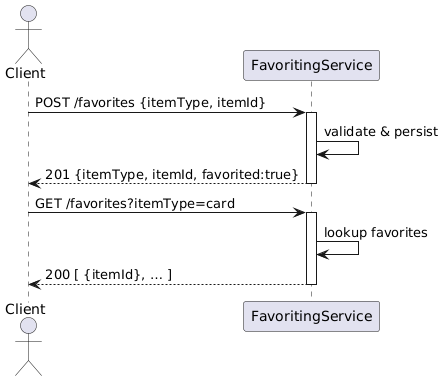

# Favoriting-Service
Oregon State CS 361 Group 41: Favoriting Test Program for Jelena

This favoriting microservice allows clients to add and list favorite items (intended for flash cards or restaurants) via a simple HTTP API. Below you’ll find everything you need to call it from your own code (no reference to the demo script is necessary).

---

## Installation & Quick Start

1. **Clone the repo**

   ```
   git clone https://github.com/rylan-holt/favoriting-service.git
   cd favoriting-service
   ```

2. **Install dependencies**

   ```
   npm install
   ```

3. **Start the service**

   ```
   npm start
   ```

   This launches an Express server on port 3000. You should see:

   ```
   Favoriting service listening on port 3000
   ```

---

## 0. Demo Usage

Once the service is running, you can exercise both endpoints with an automated demo:

  **Invoke the automated test client**
   In a second terminal (same folder), run:

   ```bash
   node test_favorites.js
   ```

   or via npm:

   ```bash
   npm run demo
   ```

   The script will:

   * POST a sample favorite (`itemType: "card"`) to `/favorites`
   * GET the list back from `/favorites?itemType=card`
   * Print both request payloads and server responses with clear labels (e.g., “📌 Adding …”, “📋 Listing …”).
  
---

## 1. Program **Request**

Clients should send an HTTP POST to `/favorites` with JSON:

```bash
curl -X POST http://localhost:3000/favorites \
     -H "Content-Type: application/json" \
     -d '{"itemType":"card","itemId":"demo-123"}'
```

* **`itemType`** must be `"card"` or `"restaurant"`.
* **`itemId`** is any unique identifier string for the item.

**Expected response (201 Created)**

```json
{
  "itemType": "card",
  "itemId": "demo-123",
  "favorited": true
}
```

---

## 2. Program **Receive**

To retrieve the list of favorites for a given type, send an HTTP GET:

```bash
curl "http://localhost:3000/favorites?itemType=card"
```

* Provide the same `itemType` query parameter.

**Expected response (200 OK)**

```json
[
  { "itemId": "demo-123" },
  { "itemId": "other-456" }
]
```
## 3. Sequence Diagram

Below is the UML sequence diagram for the Favoriting Service:



---

## 4. Mitigation Plan

**4.a. Teammate**
This Service was built for Jelena’s restaurant locator app. (but should also work with Haley’s restaurant locator app.

**4.b. Current Status**
Fully implemented and tested locally aside from dedicated commands to favorite, unfavorite, add, will be completed by **May 23, 2025** at the latest.
The POST and GET endpoints behave as documented.

**4.c. Known Issues & Timeline**
No known issues at this time. If a bug arises, it will be addressed by **May 28, 2025**.

**4.d. Accessing the Service**

* Clone from GitHub: `https://github.com/rylan-holt/favoriting-service.git`
* Run locally:

  ```
  npm install
  npm start
  ```
* The API is available at `http://localhost:3000`.

**4.e. If You Cannot Access/Call the Service**

* Verify you are in the correct folder and have run `npm install`.
* Ensure nothing else is running on port 3000.
* If the problem persists, contact me via Slack or email ([holtry@oregonstate.edu](mailto:holtry@oregonstate.edu)). I am available M–F, 2 PM – 8 PM PDT.

**4.f. Deadline for Reporting Issues**
Please notify me by **May 25, 2025 at 12:00 PM PT** so I can help before your integration deadline.

**4.g. Additional Notes**

* The service assumes well-formed JSON.
* No authentication is included.
* CORS is enabled for browser-based clients.

---
